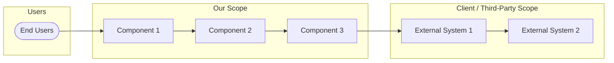
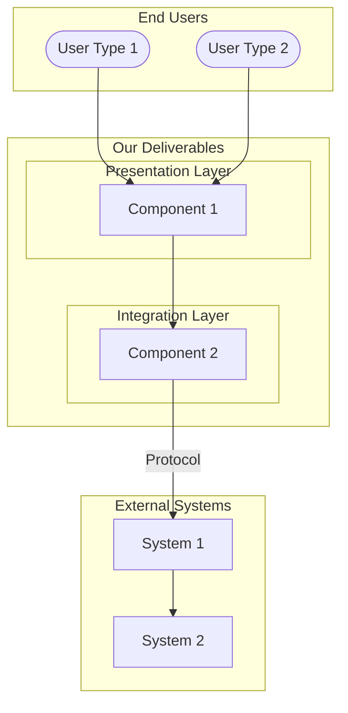

<!-- PDF EXPORT SETTINGS (Typora)
     Paper: A4 | Margins: 20mm all sides
     Theme: github or newsprint (light themes only)
     Add the @media print CSS below to your theme's .user.css file
     OR paste into Preferences → Export → PDF → Append Extra Content
-->

<style>
@media print {
  /* ── Page breaks: H1, H2, H3 all start on a new page ── */
  h1 { page-break-before: always; break-before: page; }
  h2 { page-break-before: always; break-before: page; }
  h3 { page-break-before: always; break-before: page; }

  /* H4: selective — add class="page-break" to force, otherwise flows naturally */
  h4.page-break { page-break-before: always; break-before: page; }

  /* Prevent headings from being stranded at page bottom */
  h1, h2, h3, h4 { page-break-after: avoid; break-after: avoid; }

  /* First h1 is the document title — no break before it */
  h1:first-of-type { page-break-before: avoid; break-before: avoid; }

  /* Keep tables, diagrams, and blockquotes together on one page */
  table { page-break-inside: avoid; break-inside: avoid; }
  blockquote { page-break-inside: avoid; break-inside: avoid; }
  .md-diagram-panel,
  .md-fences[lang="mermaid"] {
    page-break-inside: avoid; break-inside: avoid;
  }

  /* Prevent widows and orphans */
  p { orphans: 3; widows: 3; }

  /* Optional: suppress H3 break for short subsections that should stay grouped.
     Wrap in <div class="no-break-before"> ... </div> to override. */
  .no-break-before h3 { page-break-before: avoid; break-before: avoid; }

  /* Manual page break: insert <div class="page-break"></div> anywhere */
  .page-break { page-break-before: always; break-before: page; }
}
</style>

<!-- ⚠ PRESENTATION RULES (see _RFP_Toolkit/templates/PRESENTATION_GUIDE.md):
     - §1–§8 (main body): NO tech details (APIs, JSON, code, schemas → Appendix)
     - Technology names in body ONLY for core enablers
     - ALL diagrams: Mermaid only — ZERO ASCII art
     - Mermaid colors: ArchiMate-inspired palette (blue=our scope, green=external, yellow=users)
     - Each diagram must fit one PDF page (max 12–15 nodes)
     - Font: 11pt body, 10pt tables, 18pt H1, 14pt H2

     PAGE BREAK BEHAVIOR (handled by CSS above):
     - H1 (## 1. Executive Summary):     ALWAYS new page
     - H2 (## 2. Scope Definition):      ALWAYS new page
     - H3 (### 5.1 Team Structure):      ALWAYS new page (each subsection gets its own page)
     - H4 (#### UC#1: Use Case Name):    NO break by default — flows naturally within H3
       → To force H4 page break:  <h4 class="page-break">Title</h4>
       → Or insert before it:     <div class="page-break"></div>
     - To SUPPRESS H3 break for short subsections that should stay grouped:
       Wrap them in:  <div class="no-break-before"> ### 5.5 Short Section ... </div>
-->

# {ProjectName} — {ProposalTitle}

**Technical Proposal Document**

| Version | Date   | Author        | Status | Summary of Changes |
| ------- | ------ | ------------- | ------ | ------------------ |
| 1.0     | {Date} | {CompanyName} | Draft  | Initial proposal   |

<div style="page-break-after: always;"></div>

## Table of Contents

[TOC]

> **Mandatory Appendices:** Every proposal includes Appendix D (Feasibility Assessment)
> and Appendix E (Requirements Coverage) — generated automatically in S4 STEP F.

<div style="page-break-after: always;"></div>

## 1. Executive Summary

### 1.1 Opportunity Statement

<!-- 2-3 paragraphs: What the client needs, why now, what this proposal addresses.
     Include scope clarifications and vendor context if multi-party. -->

{ClientName} seeks to {high-level objective}.
This proposal addresses the **{specific scope boundary}**,
with {other parties} providing {their responsibilities}.

> **Scope Clarification:** This engagement delivers {deliverable summary}.
> All {out-of-scope items} remain within {other party}'s scope.

### 1.2 Business Value Proposition

| {ClientName} Need | Our Solution | Business Impact |
| ----------------- | ------------ | --------------- |
| {Need 1}          | {Solution 1} | **{Impact 1}**  |
| {Need 2}          | {Solution 2} | **{Impact 2}**  |
| {Need 3}          | {Solution 3} | **{Impact 3}**  |
| {Need 4}          | {Solution 4} | **{Impact 4}**  |

### 1.3 Solution Overview

{CompanyName} proposes a **{duration} engagement** delivering:

1. **{Deliverable 1}** — {one-line description}
2. **{Deliverable 2}** — {one-line description}
3. **{Deliverable 3}** — {one-line description}
4. **{Optional Deliverable}** — {one-line description} (if {condition})

<!-- Include a high-level architecture diagram (Mermaid recommended).
     Show system context boundaries: your scope vs client vs third-party. -->



### 1.4 Feasibility Verdict

<!-- Copy the one-line verdict from Appendix D §D.7 here. -->

> **{OVERALL: GO / GO with N conditions / NO-GO}** — {one sentence summary}.
> Full assessment: [Appendix D](#appendix-d-feasibility-assessment).

### 1.5 Investment Summary

| Component          | Description                         |
| ------------------ | ----------------------------------- |
| **Duration**       | {N} weeks / months                  |
| **Team Size**      | {N} specialists                     |
| **Total Effort**   | **{N} MD** (see §5-6 for breakdown) |
| **Delivery Model** | {Agile / Waterfall / Hybrid}        |
| **Key Dependency** | {Primary external dependency}       |
| **Compliance**     | {Applicable framework or "N/A"}     |

> **Note:** {Any critical enablers, cost exclusions, or timeline conditions.}

---

## 2. Scope Definition

### 2.1 {CompanyName} Scope (In-Scope)

| Component         | Description   | Deliverable            |
| ----------------- | ------------- | ---------------------- |
| **{Component 1}** | {Description} | {Deliverable artifact} |
| **{Component 2}** | {Description} | {Deliverable artifact} |
| **{Component 3}** | {Description} | {Deliverable artifact} |
| **{Component 4}** | {Description} | {Deliverable artifact} |

### 2.2 Out of {CompanyName} Scope

| Component    | Responsibility | Notes           |
| ------------ | -------------- | --------------- |
| **{Item 1}** | {Owner}        | {Clarification} |
| **{Item 2}** | {Owner}        | {Clarification} |
| **{Item 3}** | {Owner}        | {Clarification} |

### 2.3 Scope Boundaries

| Boundary         | Clarification                 |
| ---------------- | ----------------------------- |
| **{Boundary 1}** | {What this means in practice} |
| **{Boundary 2}** | {What this means in practice} |
| **{Boundary 3}** | {What this means in practice} |

### 2.4 Regulatory Considerations

<!-- CONDITIONAL SECTION: Include ONLY if domain requires compliance.
     Delete entirely if no regulatory framework applies.

     Examples of when to include:
     - GxP / FDA / EMA: Pharma, medical devices, labs
     - SOX: Financial systems
     - HIPAA: Healthcare data
     - PCI-DSS: Payment processing
     - GDPR: EU personal data processing
     - ISO 27001: Information security management
-->

> **⚠️ Regulatory Context:** {Brief context on why this section exists.}

**Applicability Assessment:**

| Factor                   | Assessment                                               |
| ------------------------ | -------------------------------------------------------- |
| **System Purpose**       | {What the system does relative to regulation}            |
| **Decision Support**     | {Whether system replaces or informs regulated processes} |
| **Compliance Ownership** | {Who owns compliance — us, client, third party}          |

**Recommendation:**

| Scenario           | Compliance Approach                |
| ------------------ | ---------------------------------- |
| **{Phase 1}**      | {Recommendation for initial scope} |
| **{Future Phase}** | {Recommendation if scope expands}  |

---

## 3. Assumptions, Constraints & Risks

### 3.1 Assumptions

| ID  | Assumption                | Owner   | Impact if False |
| --- | ------------------------- | ------- | --------------- |
| A1  | **{Critical assumption}** | {Owner} | {Impact}        |
| A2  | {Assumption}              | {Owner} | {Impact}        |
| A3  | {Assumption}              | {Owner} | {Impact}        |
| A4  | {Assumption}              | {Owner} | {Impact}        |

### 3.2 Constraints

| ID  | Constraint   | Enforcement    |
| --- | ------------ | -------------- |
| C1  | {Constraint} | {How enforced} |
| C2  | {Constraint} | {How enforced} |
| C3  | {Constraint} | {How enforced} |

### 3.3 Risks & Mitigations

| Risk     | Probability    | Impact         | Mitigation            |
| -------- | -------------- | -------------- | --------------------- |
| {Risk 1} | {Low/Med/High} | {Low/Med/High} | {Mitigation strategy} |
| {Risk 2} | {Low/Med/High} | {Low/Med/High} | {Mitigation strategy} |
| {Risk 3} | {Low/Med/High} | {Low/Med/High} | {Mitigation strategy} |

### 3.4 Critical Dependencies

| Dependency         | Source   | Required By | Impact if Delayed |
| ------------------ | -------- | ----------- | ----------------- |
| **{Critical dep}** | {Source} | **{When}**  | {Impact}          |
| {Dependency}       | {Source} | {When}      | {Impact}          |

---

## 4. Use Cases & Functional Specifications

<!-- ⚠ USE CASES ARE MANDATORY for every project type.
     The rest of §4 is domain-adaptive — pick the subsections that apply.

     ⚠ PRESENTATION RULE: This section is BUSINESS-READABLE.
     NO API endpoints, JSON schemas, code, or protocol details here.
     Describe WHAT the system does, not HOW it is implemented.
     All technical implementation detail → Appendix A.

     DOMAIN ADAPTATION GUIDE:

     | Project Type              | §4.1 Use Cases | §4.2 Adapt As                          | §4.3 Focus On                     |
     |---------------------------|----------------|----------------------------------------|-----------------------------------|
     | Web Application (SPA/PWA) | ✓ MANDATORY    | Feature / Module Overview              | User workflows, business rules    |
     | IoT / Engineering System  | ✓ MANDATORY    | Device & Data Flow Overview            | Monitoring goals, alert scenarios |
     | Enterprise Integration    | ✓ MANDATORY    | Interface & Connector Overview         | Sync scope, data ownership        |
     | Mobile Application        | ✓ MANDATORY    | Screen / User Journey Overview         | Offline scenarios, user flows     |
     | Data Platform / Analytics | ✓ MANDATORY    | Pipeline & Report Overview             | KPIs, data sources, refresh SLAs  |
     | Managed Service / Ops     | ✓ MANDATORY    | Service Catalogue & SLA Overview       | Service levels, escalation paths  |
     | Proof of Concept          | ✓ MANDATORY    | Hypothesis & Validation Criteria       | Success metrics, pivot criteria   |
     | Dashboard / Visualization | ✓ MANDATORY    | Dashboard / View Overview              | Operator needs, decision support  |
-->

### 4.1 Use Cases (Mandatory)

<!-- ⚠ ALWAYS include use cases regardless of project type.
     Use cases connect business needs (§1-§2) to technical delivery (§5-§7).
     Without them the WBS has no traceability to business value. -->

| UC#  | Name            | Actors          | Priority                | Sites / Environments |
| ---- | --------------- | --------------- | ----------------------- | -------------------- |
| UC#1 | {use_case_name} | {who_interacts} | {Must / Should / Could} | {where_it_applies}   |
| UC#2 | {use_case_name} | {who_interacts} | {Must / Should / Could} | {where_it_applies}   |
| UC#3 | {use_case_name} | {who_interacts} | {Must / Should / Could} | {where_it_applies}   |

#### UC#1: {Use Case Name}

**Current Situation (Pain Points):**

- {pain_point_1}
- {pain_point_2}

**Target Situation (Benefits):**

- {benefit_1}
- {benefit_2}

**Trigger:** {what_starts_the_process}

**Main Flow:**

1. {step_1}
2. {step_2}
3. {step_3}

**Acceptance Criteria:**

- {criterion_1}
- {criterion_2}

<!-- Repeat UC block for each use case -->

### 4.2 {Domain-Specific} Overview

<!-- ADAPT this section heading and content to your project type.
     Examples:
       - "Module Overview" (web app)
       - "Device & Data Flow Overview" (IoT)
       - "Interface & Connector Overview" (integration)
       - "Dashboard Overview" (visualization)
       - "Service Catalogue" (managed service)
-->

| {Component}  | Primary Purpose | Key Capabilities | Linked Use Cases |
| ------------ | --------------- | ---------------- | ---------------- |
| **{Item 1}** | {Purpose}       | {Capabilities}   | UC#1, UC#2       |
| **{Item 2}** | {Purpose}       | {Capabilities}   | UC#3             |
| **{Item 3}** | {Purpose}       | {Capabilities}   | UC#1             |

### 4.3 {Component} Descriptions

#### {Item 1}

<!-- 3-5 bullet points per item describing:
     - What it does (functional behavior)
     - Key user or system interactions
     - Data it consumes / produces / transforms
     - Notable constraints or dependencies
     - Linked use cases it satisfies -->

#### {Item 2}

#### {Item 3}

### 4.4 Data Requirements

<!-- HIGH-LEVEL data requirements only — what data is needed, not how it flows.
     Example: "Real-time asset location data from RFID readers, refreshed every 30 seconds"
     NOT: "GET /api/v1/assets?zone=lab-01 returns JSON array with fields..."
     Detailed schemas, API contracts, payload formats → Appendix A.5 -->

### 4.5 Customization / Configuration

<!-- BUSINESS-LEVEL customization needs only.
     Example: "Dashboard layouts configurable per site (Nyon vs Levice)"
     NOT: "Set SITE_CONFIG=nyon in environment variables..."
     Technical configuration parameters → Appendix B. -->

---

## 5. Team Composition

<!-- CRITICAL: Team composition must be driven by System Context Decomposition.
     1. Identify bounded system contexts from §2 and §4
     2. Assign one RACI R/A owner per context
     3. Map supplemental roles (C or R-only)
     4. This decomposition drives parallel workstreams in §7 -->

### 5.1 Team Structure

> **Design Principle:** {Why this team size and shape — e.g., low-code platform,
> focused scope, specialized integration, etc.}

| Role                               | Total MD | Engagement Period | Responsibilities       |
| ---------------------------------- | -------- | ----------------- | ---------------------- |
| **{Role 1 — typically Team Lead}** | {MD}     | {Period} ()    | {Key responsibilities} |
| **{Role 3}**                       | {MD}     | {Period} ()    | {Key responsibilities} |
| **{Role 5}**                       | {MD}     | {Period} ({%})    | {Key responsibilities} |

**Total Project Team:** {N} specialists | **{N} MD** | **Duration: {N} weeks/months**

> **Allocation Note:** {Clarify engagement patterns — who is full-time,
> who is fractional, any roles absorbed by others (e.g., QA into dev).}

### 5.2 Team Rationale

| Decision                  | Justification          |
| ------------------------- | ---------------------- |
| **{Staffing decision 1}** | {Why this makes sense} |
| **{Staffing decision 2}** | {Why this makes sense} |
| **{Staffing decision 3}** | {Why this makes sense} |
| **{Role not included}**   | {Why it's not needed}  |

### 5.3 Out of Scope (Handled Separately)

<!-- Activities performed by other parties (client, third-party, other teams)
     NOT included in MD count. -->

| Activity         | Owner   | Notes           |
| ---------------- | ------- | --------------- |
| **{Activity 1}** | {Owner} | {Clarification} |
| **{Activity 2}** | {Owner} | {Clarification} |

### 5.4 {ClientName} Resource Requirements

| Role                | Involvement            | Timing |
| ------------------- | ---------------------- | ------ |
| **{Client role 1}** | {What they need to do} | {When} |
| **{Client role 2}** | {What they need to do} | {When} |

### 5.5 External Coordination Requirements

<!-- Third-party dependencies, Day 0 readiness, integration prerequisites. -->

| Dependency         | Required From | Required By | Status   |
| ------------------ | ------------- | ----------- | -------- |
| **{Dependency 1}** | {Party}       | **{When}**  | {Status} |
| **{Dependency 2}** | {Party}       | **{When}**  | {Status} |

---

## 6. Work Breakdown Structure

<!-- WBS RULES:
     1. Each deliverable has: Name, MD, Owner (RACI R/A), Key Activities
     2. Owner must match a role from §5.1
     3. Phase totals must sum to project total
     4. Project total must match §5.1 total and §1.4 investment
     5. Use whole numbers for MD (no fractions)
-->

### 6.1 Phase 1: {Phase Name} ({Duration})

**Phase Objective:** {One sentence describing the goal of this phase.}

> **Pre-requisite:** {Any dependencies that must be met before this phase starts.}

| Deliverable            | MD  | Owner  | Key Activities |
| ---------------------- | --- | ------ | -------------- |
| **D1.1 {Deliverable}** | {N} | {Role} | {Activities}   |
| **D1.2 {Deliverable}** | {N} | {Role} | {Activities}   |
| **D1.3 {Deliverable}** | {N} | {Role} | {Activities}   |

**Phase 1 Total:** {N} MD

**Key Outputs:**

- {Output 1}
- {Output 2}
- {Output 3}

### 6.2 Phase 2: {Phase Name} ({Duration})

**Phase Objective:** {Goal.}

| Deliverable            | MD  | Owner  | Key Activities |
| ---------------------- | --- | ------ | -------------- |
| **D2.1 {Deliverable}** | {N} | {Role} | {Activities}   |
| **D2.2 {Deliverable}** | {N} | {Role} | {Activities}   |
| **D2.3 {Deliverable}** | {N} | {Role} | {Activities}   |

**Phase 2 Total:** {N} MD

### 6.3 Phase 3: {Phase Name} ({Duration})

**Phase Objective:** {Goal.}

| Deliverable            | MD  | Owner  | Key Activities |
| ---------------------- | --- | ------ | -------------- |
| **D3.1 {Deliverable}** | {N} | {Role} | {Activities}   |
| **D3.2 {Deliverable}** | {N} | {Role} | {Activities}   |

**Phase 3 Total:** {N} MD

<!-- Add more phases as needed: Phase 4, 5, etc. -->

### 6.N WBS Summary

| Phase               | Duration       | Total MD | Key Milestone |
| ------------------- | -------------- | -------- | ------------- |
| **Phase 1: {Name}** | {Duration}     | {N}      | {Milestone}   |
| **Phase 2: {Name}** | {Duration}     | {N}      | {Milestone}   |
| **Phase 3: {Name}** | {Duration}     | {N}      | {Milestone}   |
| **Total**           | **{Duration}** | **{N}**  |               |

> **Verification:** WBS total ({N} MD) aligns with team allocation (§5.1: {N} MD)
> and investment summary (§1.4: {N} MD). ✓

---

## 7. Timeline & Gantt Chart

### 7.1 Project Timeline

> **Note:** Gantt bars show **schedule duration** (when work occurs), not effort.
> See §6 WBS for effort breakdown.

```mermaid
gantt
    title {ProjectName} - Project Timeline ({N} Weeks)
    dateFormat YYYY-MM-DD
    excludes weekends

    section PHASE 1 - {Name} ({N} MD)
    D1.1 {Deliverable} ({N} MD)   :a1, {start}, {duration}d
    D1.2 {Deliverable} ({N} MD)   :a2, {start}, {duration}d
    PHASE 1 COMPLETE              :milestone, m1, {date}, 0d

    section PHASE 2 - {Name} ({N} MD)
    D2.1 {Deliverable} ({N} MD)   :b1, {start}, {duration}d
    D2.2 {Deliverable} ({N} MD)   :b2, {start}, {duration}d
    PHASE 2 COMPLETE              :milestone, m2, {date}, 0d

    section PHASE 3 - {Name} ({N} MD)
    D3.1 {Deliverable} ({N} MD)   :c1, {start}, {duration}d
    D3.2 {Deliverable} ({N} MD)   :c2, {start}, {duration}d
    GO-LIVE                       :milestone, m3, {date}, 0d
```

### 7.2 Team Allocation Timeline

> **Note:** Bar length shows engagement period.
> Effort (MD) shown in section titles.

```mermaid
gantt
    title Team Allocation by Role ({N} MD Total)
    dateFormat YYYY-MM-DD
    excludes weekends

    section {Role 1} ({N} MD)
    {Allocation %}        :active, r1, {start}, {duration}d

    section {Role 2} ({N} MD)
    {Allocation %}        :r2, {start}, {duration}d

    section {Role 3} ({N} MD)
    {Allocation %}        :r3, {start}, {duration}d
```

### 7.3 Detailed Timeline

| Week | Phase | Key Activities | Team Active | Milestone      |
| ---- | ----- | -------------- | ----------- | -------------- |
| 1    | 1     | {Activities}   | {Roles}     | **M1: {Name}** |
| 2    | 2     | {Activities}   | {Roles}     |                |
| ...  | ...   | ...            | ...         |                |
| N    | N     | {Activities}   | {Roles}     | **MN: {Name}** |

> **Legend:** {Role abbreviation explanations}

### 7.4 Development Strategy

<!-- Describe the approach that enables the proposed timeline.
     Examples: Mock-first integration, parallel workstreams,
     phased rollout, feature flags, etc. -->

| Factor           | Benefit                     |
| ---------------- | --------------------------- |
| **{Strategy 1}** | {How it helps the timeline} |
| **{Strategy 2}** | {How it helps the timeline} |

### 7.5 Timeline Enablers

The {N}-week timeline is enabled by:

- **{Enabler 1}** — {How it accelerates delivery}
- **{Enabler 2}** — {How it accelerates delivery}
- **{Enabler 3}** — {How it accelerates delivery}

---

## 8. Next Steps

### 8.1 Recommended Actions

| Step | Action                | Owner   | Timeline   |
| ---- | --------------------- | ------- | ---------- |
| 1    | {Action}              | {Owner} | {When}     |
| 2    | **{Critical action}** | {Owner} | **{When}** |
| 3    | {Action}              | {Owner} | {When}     |

> **⚠️ Critical Pre-requisite:** {State the most important dependency
> that must be resolved before project start.}

### 8.2 Key Contacts Required

| Role         | Organization | Responsibility |
| ------------ | ------------ | -------------- |
| **{Role 1}** | {Org}        | {What they do} |
| **{Role 2}** | {Org}        | {What they do} |

---

## Appendix A: Technical Architecture

<!-- ⚠ ALL technical detail lives here — not in §1–§8.
     This appendix is for engineering stakeholders.
     Include: system context, component architecture, data flows,
     deployment architecture, API contracts, integration sequence diagrams.

     DIAGRAM RULES:
     - Mermaid only (no ASCII art)
     - ArchiMate-inspired colors (blue=our scope, green=external, yellow=users)
     - Bold subgraph titles: subgraph Name["<b>Display Name</b>"]
     - Each diagram fits one PDF page (max 12–15 nodes)
     - Style every node: style NodeId fill:#hex,stroke:#hex,color:#hex
     - See _RFP_Toolkit/templates/PRESENTATION_GUIDE.md for full palette -->

### A.1 System Context Diagram

<!-- Detailed version of the §1.3 overview diagram.
     Show ALL system boundaries, protocols, data flows.
     This is where protocol labels (REST, MQTT, gRPC) belong. -->



### A.2 Component Architecture

<!-- Internal component breakdown, interfaces, data models.
     This is where module-level diagrams, API endpoint tables,
     and internal data flow details belong. -->

### A.3 Integration Flow

<!-- Sequence diagrams or data flow diagrams showing integration points.
     Include: protocol details, payload examples, authentication flows.
     Use Mermaid sequence diagrams where appropriate. -->

### A.4 Deployment Architecture

<!-- Infrastructure, containers, networking, environments.
     Include: server specs, container orchestration, network topology.
     Use Mermaid flowchart for deployment diagrams. -->

### A.5 API Contracts

<!-- REST/GraphQL/MQTT endpoint definitions, payload schemas,
     authentication details, error handling.
     This is the ONLY place for JSON/XML examples in the document. -->

---

## Appendix B: Technology Stack

### B.1 Core Technologies

| Technology | Version | Purpose   | License   |
| ---------- | ------- | --------- | --------- |
| {Tech 1}   | {Ver}   | {Purpose} | {License} |
| {Tech 2}   | {Ver}   | {Purpose} | {License} |
| {Tech 3}   | {Ver}   | {Purpose} | {License} |

### B.2 {Domain-Specific Technologies}

<!-- E.g., "Dashboard Widgets", "SDK Dependencies",
     "Infrastructure Components", etc. -->

---

## Appendix C: Glossary

| Term          | Definition              |
| ------------- | ----------------------- |
| **{Term 1}**  | {Definition}            |
| **{Term 2}**  | {Definition}            |
| **{Acronym}** | {Expansion and meaning} |

---

<div style="page-break-after: always;"></div>

## Appendix D: Feasibility Assessment

<!-- MANDATORY — generated in STEP F.1 of S4_Proposal_Generation.md -->

### D.1 Overview

This section assesses whether the project is viable as described —
across technology, economics, compliance, operations, and schedule.

Each area is evaluated on a three-point scale:

| Verdict                | Meaning                                                       |
| ---------------------- | ------------------------------------------------------------- |
| **GO**                 | Viable as specified; no prerequisites required                |
| **GO with conditions** | Viable if stated prerequisites are confirmed before start     |
| **NO-GO**              | Not viable as specified; a change in scope or approach needed |

### D.2 Technology & Architecture

<!-- Assess: Can this be built with available tools, skills, and infrastructure?
     Address: key complexity drivers, technology maturity, infrastructure constraints. -->

**Assessment:**

{2–4 sentences on whether the proposed technology and architecture are buildable.}

**Prerequisites that must be confirmed before project start:**

| ID  | Prerequisite                       | Required By |
| --- | ---------------------------------- | ----------- |
| T1  | {e.g. access to third-party API}   | {Date/M#}   |
| T2  | {e.g. data migration scope agreed} | {Date/M#}   |

**Verdict:** {GO / GO with conditions T1, T2 / NO-GO}

### D.3 Schedule

<!-- Assess: Can the full scope be delivered within the stated timeline?
     Ground this in actual WBS effort from §6, not an estimate.
     Address: critical path, parallel workstreams, key schedule risks. -->

**Assessment:**

{2–4 sentences on whether the timeline is achievable for the stated scope.}

**Key schedule risks:**

| Risk              | Probability | Impact | Mitigation            |
| ----------------- | ----------- | ------ | --------------------- |
| {Schedule risk 1} | Medium      | High   | {How this is handled} |
| {Schedule risk 2} | Low         | Medium | {How this is handled} |

**Verdict:** {GO / GO with conditions / NO-GO}

### D.4 Legal & Compliance

<!-- Assess: Does the project comply with applicable laws and standards?
     Reference any regulatory frameworks identified in §2.4.
     If none apply, write "No legal or compliance barriers identified." -->

**Assessment:**

{2–4 sentences on compliance posture and any legal prerequisites.}

| Framework / Standard | Applicability | Approach                     |
| -------------------- | ------------- | ---------------------------- |
| {Framework 1}        | Direct        | {How requirements are met}   |
| {Framework 2}        | Aligned       | {How principles are applied} |

**Verdict:** {GO / GO with conditions / NO-GO}

### D.5 Operations & Handover

<!-- Assess: Can the CLIENT organisation absorb, operate, and maintain the system?
     This is about their capacity, not ours.
     Address: client team readiness, change management, handover plan. -->

**Assessment:**

{2–4 sentences on the client's operational readiness and what is required from them.}

**Operational prerequisites:**

| ID  | What the client needs to have in place                | Required By |
| --- | ----------------------------------------------------- | ----------- |
| O1  | {e.g. IT team hired; local maintenance partner named} | {Date/M#}   |

**Verdict:** {GO / GO with conditions / NO-GO}

### D.6 Economics & Value

<!-- Assess: Is the investment justified? Are costs proportionate to expected value?
     Include quantified outcomes where available.
     If the economic case is self-evident, keep this section brief. -->

**Assessment:**

{2–4 sentences on the economic justification for the project.}

| Indicator            | Value / Evidence                              |
| -------------------- | --------------------------------------------- |
| {Expected outcome 1} | {Quantified target or description}            |
| {Expected outcome 2} | {Quantified target or description}            |
| {Funding / mandate}  | {Who is funding; what makes this sustainable} |

**Verdict:** {GO / GO with conditions / NO-GO}

### D.7 Feasibility Verdict

```
┌──────────────────────────────────────────────────────────┐
│                   FEASIBILITY VERDICT                    │
│                                                          │
│  AREA                 VERDICT    CONDITIONS              │
│  ──────────────────────────────────────────────────      │
│  Technology           {GO ✓ / GO conditions / NO-GO}     │
│  Schedule             {GO ✓ / GO conditions / NO-GO}     │
│  Legal & Compliance   {GO ✓ / GO conditions / NO-GO}     │
│  Operations           {GO ✓ / GO conditions / NO-GO}     │
│  Economics            {GO ✓ / GO conditions / NO-GO}     │
│                                                          │
│  OVERALL: {GO / GO with N conditions / NO-GO}            │
│                                                          │
│  Prerequisites (must be confirmed before project start): │
│    {T1}: {description}                                   │
│    {T2}: {description}                                   │
│    {O1}: {description}                                   │
└──────────────────────────────────────────────────────────┘
```

<!-- Copy the OVERALL one-liner into §1.4 Feasibility Verdict of the proposal body. -->

---

<div style="page-break-after: always;"></div>

## Appendix E: Requirements Coverage

<!-- MANDATORY — generated in STEP F.2 of S4_Proposal_Generation.md -->

### E.1 How to Read This Appendix

This appendix maps every stated requirement against the proposed delivery approach,
showing what is delivered as-specified, what is delivered differently, and why.

| Code     | Meaning              | Definition                                                                                        |
| -------- | -------------------- | ------------------------------------------------------------------------------------------------- |
| **C**    | Met                  | Requirement is delivered exactly as stated                                                        |
| **PC**   | Partially Met        | Requirement is substantially delivered; a specific deviation or condition is documented           |
| **NC+A** | Alternative Proposed | Literal delivery is not the right approach; a superior or equivalent alternative is proposed here |

Every PC and NC+A entry includes the reason for the deviation
and the impact on effort and timeline.

### E.2 Architecture

| #   | Requirement                  | Code   | Our Approach                  | Gap / Condition          |
| --- | ---------------------------- | ------ | ----------------------------- | ------------------------ |
| A1  | {Architecture requirement 1} | **C**  | {How we comply}               | —                        |
| A2  | {Architecture requirement 2} | **PC** | {How we substantially comply} | {Deviation or condition} |
| A3  | {Architecture requirement 3} | **C**  | {How we comply}               | —                        |

### E.3 Functional Requirements

<!-- Group by domain, Epic, or module matching §4 of the proposal. -->

#### {Domain / Module 1}

| #   | Requirement                | Code   | Our Approach                  | Gap / Condition          |
| --- | -------------------------- | ------ | ----------------------------- | ------------------------ |
| F1  | {Functional requirement 1} | **C**  | {How we comply}               | —                        |
| F2  | {Functional requirement 2} | **PC** | {How we substantially comply} | {Deviation or condition} |
| F3  | {Functional requirement 3} | **C**  | {How we comply}               | —                        |

#### {Domain / Module 2}

| #   | Requirement                | Code  | Our Approach    | Gap / Condition |
| --- | -------------------------- | ----- | --------------- | --------------- |
| F4  | {Functional requirement 4} | **C** | {How we comply} | —               |

### E.4 Non-Functional Requirements

| #   | Requirement                 | Code   | Our Approach                  | Gap / Condition          |
| --- | --------------------------- | ------ | ----------------------------- | ------------------------ |
| NF1 | {Performance requirement}   | **C**  | {How we comply}               | —                        |
| NF2 | {Security requirement}      | **C**  | {How we comply}               | —                        |
| NF3 | {Accessibility requirement} | **PC** | {How we substantially comply} | {Deviation or condition} |

### E.5 Integration Requirements

| #   | Integration / System | Code   | Protocol / Method            | Condition   |
| --- | -------------------- | ------ | ---------------------------- | ----------- |
| I1  | {External system 1}  | **C**  | {REST / SOAP / OAuth / etc.} | —           |
| I2  | {External system 2}  | **PC** | {Protocol}                   | {Condition} |

### E.6 Regulatory & Compliance Requirements

<!-- Include only if §2.4 Regulatory Considerations exists in the proposal body. -->

| #   | Framework                | Code   | How Met         | Gap                               |
| --- | ------------------------ | ------ | --------------- | --------------------------------- |
| R1  | {Regulatory framework 1} | **C**  | {How we comply} | —                                 |
| R2  | {Regulatory framework 2} | **PC** | {How we align}  | {Aspiration vs formal obligation} |

### E.7 Standard Software Requirements

<!-- Include only if the RFP/ToR specifies required standard tools or components. -->

| #   | Required Tool / Component | Proposed Solution    | Hosting    | Code  | Gap |
| --- | ------------------------- | -------------------- | ---------- | ----- | --- |
| S1  | {Standard tool 1}         | {OSS / COTS product} | {Location} | **C** | —   |
| S2  | {Standard tool 2}         | {OSS / COTS product} | {Location} | **C** | —   |

### E.8 Deviations & Alternative Approaches

<!-- One sub-section per deviation (D1, D2, …).
     A deviation is any requirement where delivering it exactly as stated
     would create a technical, compliance, operational, or schedule problem.
     Each entry proposes a confident alternative that achieves the same objective. -->

#### D1 — {Short description}

| Field              | Content                                                                                                            |
| ------------------ | ------------------------------------------------------------------------------------------------------------------ |
| **Requirement**    | {Verbatim requirement from source document}                                                                        |
| **Why we deviate** | {Plain explanation of the problem with literal delivery — technology, compliance, schedule, or operational reason} |
| **Code**           | **PC** / **NC+A**                                                                                                  |
| **Our approach**   | {The alternative we propose, stated with confidence. Frame as a better solution, not an apology.}                  |
| **Impact**         | {Effort: +N MD / within current allocation. Timeline: no change / +N weeks.}                                       |

#### D2 — {Short description}

| Field              | Content                      |
| ------------------ | ---------------------------- |
| **Requirement**    | {Verbatim requirement}       |
| **Why we deviate** | {Plain explanation}          |
| **Code**           | **PC** / **NC+A**            |
| **Our approach**   | {The alternative we propose} |
| **Impact**         | {Effort and timeline effect} |

<!-- Add D3, D4, … as needed. -->

### E.9 Coverage Summary

| Area                           | Met (C) | Partial (PC) | Alternative (NC+A) | Total   |
| ------------------------------ | ------- | ------------ | ------------------ | ------- |
| Architecture (§E.2)            | {N}     | {N}          | {N}                | {N}     |
| Functional (§E.3)              | {N}     | {N}          | {N}                | {N}     |
| Non-Functional (§E.4)          | {N}     | {N}          | {N}                | {N}     |
| Integration (§E.5)             | {N}     | {N}          | {N}                | {N}     |
| Regulatory & Compliance (§E.6) | {N}     | {N}          | {N}                | {N}     |
| Standard Software (§E.7)       | {N}     | {N}          | {N}                | {N}     |
| **Total**                      | **{N}** | **{N}**      | **{N}**            | **{N}** |

> Every partial and alternative entry has a documented approach in §E.8.
> All requirements are addressed — nothing is left unresolved.

<!-- Add additional appendices as needed:
     - Appendix F: AI-Assisted Development (always include — see AGENTS.md)
     - Appendix G: Data Model / Schema
     - Appendix H: Cost Optimisation Options
-->

---

<!-- PROPOSAL CHECKLIST (remove before submission):

 CONSISTENCY:
 [ ] §1.5 Investment Total MD = §5.1 Team Total MD = §6.N WBS Total MD
 [ ] Each WBS phase total = sum of its deliverable MDs
 [ ] Every in-scope item (§2.1) appears in at least one WBS deliverable
 [ ] Every WBS deliverable owner matches a role in §5.1
 [ ] Gantt durations (§7.1) accommodate deliverable effort
 [ ] No role overallocated in any given week (§7.2 vs §5.1)
 [ ] All critical dependencies (§3.4) have mitigations (§3.3)
 [ ] All acronyms used in the body are defined in Appendix C
 [ ] Regulatory section (§2.4) included only if applicable
 [ ] Out-of-scope items (§2.2) are not referenced in WBS
 [ ] Version table reflects current state
 [ ] Appendix D: Feasibility Assessment exists with all five areas assessed and verdict box
 [ ] §1.4 Feasibility Verdict one-liner matches §D.7 OVERALL verdict
 [ ] Appendix E: Requirements Coverage exists with Coverage Summary (§E.9)
 [ ] §E.9: every NC+A entry has a documented alternative in §E.8 Deviations
 [ ] §E.8 Deviations: each entry has Impact (effort delta + timeline effect)
 [ ] No academic framework names or paper citations visible in the proposal body

 PRESENTATION (see PRESENTATION_GUIDE.md):
 [ ] Zero API endpoints, JSON, code, or schemas in §1–§8
 [ ] Technology names in body only for core enablers
 [ ] Zero ASCII art diagrams — all Mermaid
 [ ] Mermaid diagrams use ArchiMate color palette
 [ ] Each diagram fits one PDF page (max 12–15 nodes)
 [ ] Subgraph titles are bold (<b> tags)
 [ ] Node shapes match type (cylinder=DB, rounded=actors, rect=components)
 [ ] Each §1–§8 and Appendix starts on a new page
 [ ] Tables do not split across pages
 [ ] Mermaid renders as SVG in PDF (no raw source visible)
 [ ] TOC generated and accurate
 [ ] Fonts consistent (11pt body, 10pt tables)
-->
